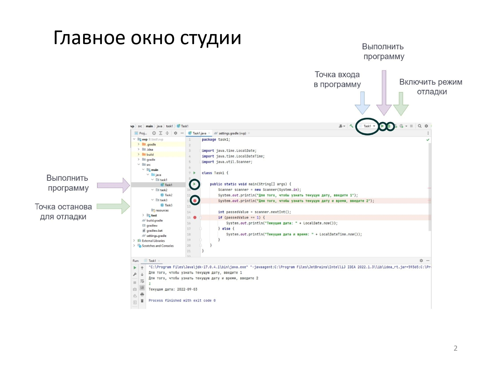
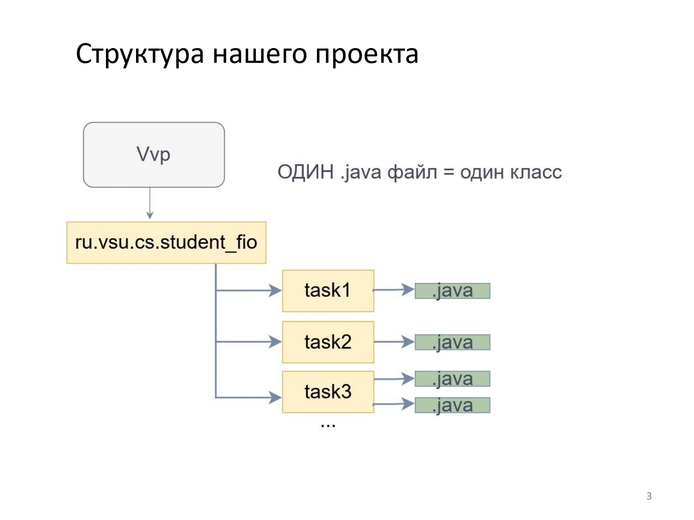
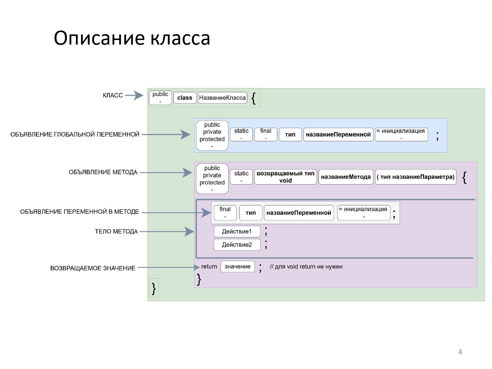
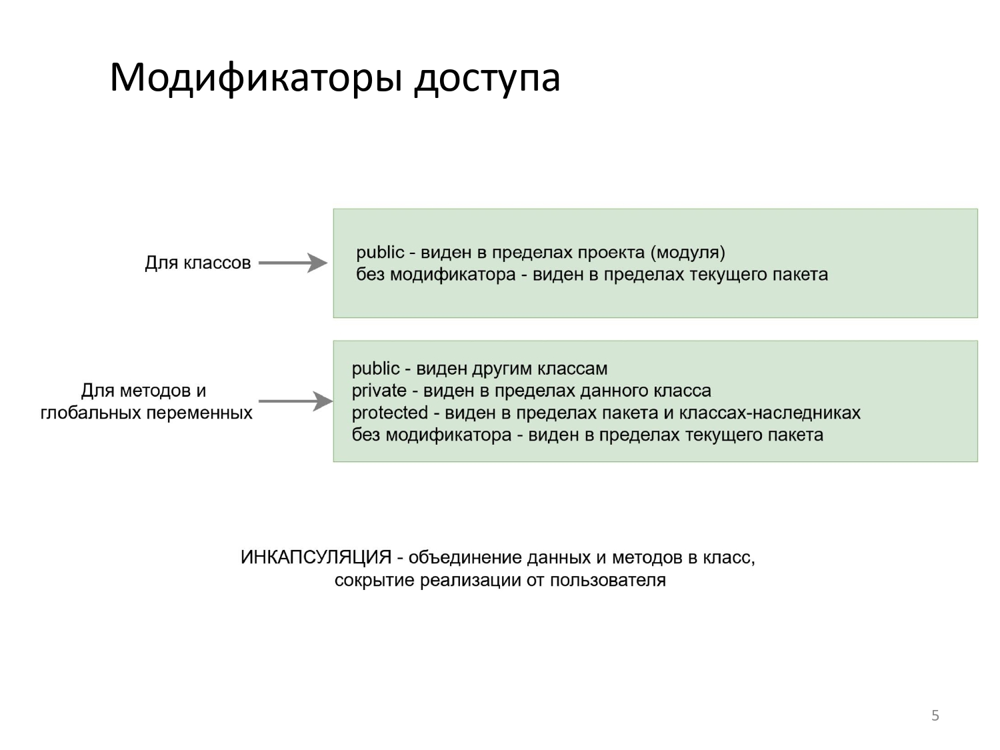
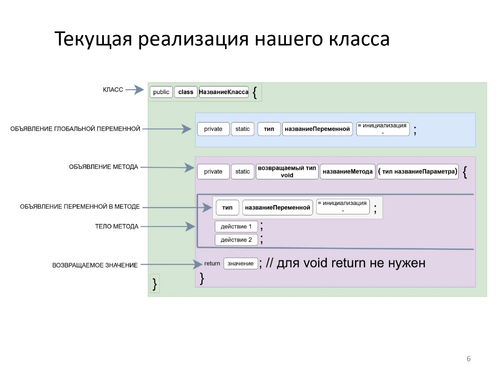
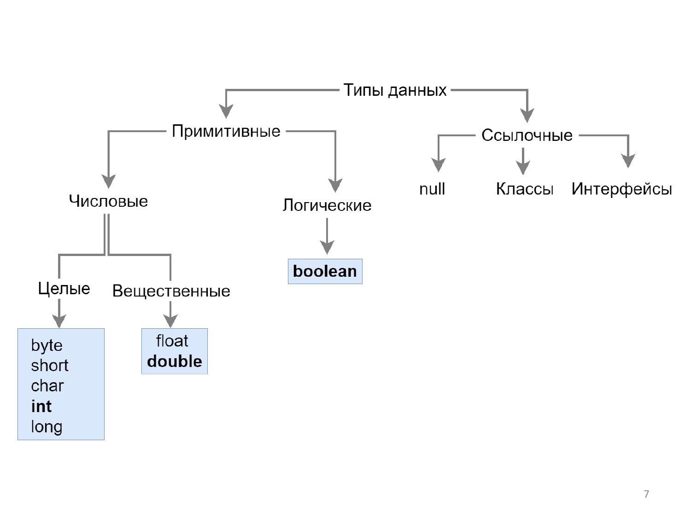
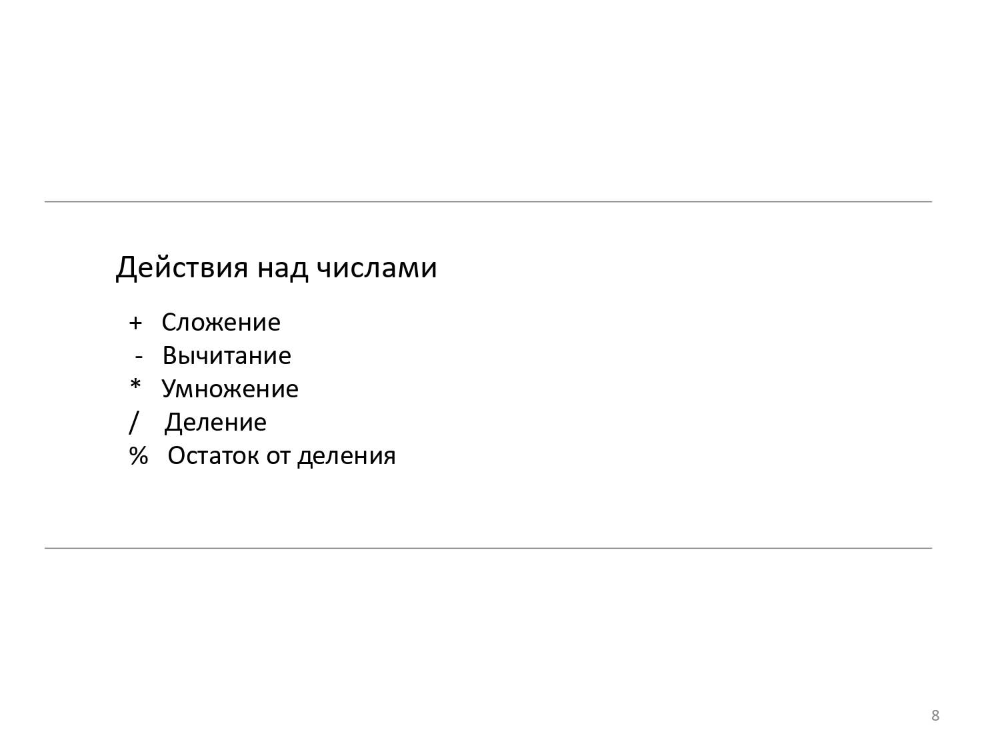
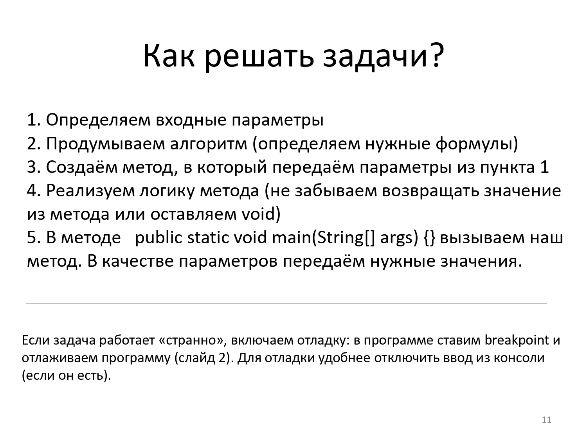

## Создание проекта

```File``` &rarr; ```new Project``` &rarr; ```Empty project``` , в поле ```Name``` вводим **vvp**, в ```Location```
можно указать другое место для создания проекта &rarr; ```Create```

Добавляем в проект иерархию папок . Нажимаем правой кнопкой мыши на ```src``` и создаём иерархию следующего вида:
`ru.cs.vsu.lastname_name.tasks` . В папке tasks будут
лежать все ваши задачки. Для каждой задачи создаём отдельную папку taskN (к концу семестра у вас будут 13 папок с
задачами).

## Структура класса

```
 public class НазваниеКласса{ 
 
 }
```

## Примитивные типы данных:

> * int (числовой, целочисленные значения)
> * double (числовой, вещественные значения)
> * boolean (логический, принимает значения true или false)

## Структура метода

``` 
  public static типВозвращаемогоЗначения названиеМетода(тип названиеПараметра, тип названиеПараметра1) { 
    return переменная; // или return выражение; или если возвращаемое значение - void, то return не нужен
  }
``` 

## Инициализация переменной примитивного типа

> тип название = выражение;

### Дополнительные классы, которые можно использовать в работе над задачами:

> * Math (математические константы и операции)
> * Scanner (класс для чтения входного потока)
> * System


Итого **шаблон класса** для выполнения задач:

``` 
public class Task1{

  /*
  Обязательный метод. Точка входа в программу
  */
  public static void main(String[] args) {
    additionalFunction();
  }
  
  public static void additionalFunction(){
  }
}
```
 








