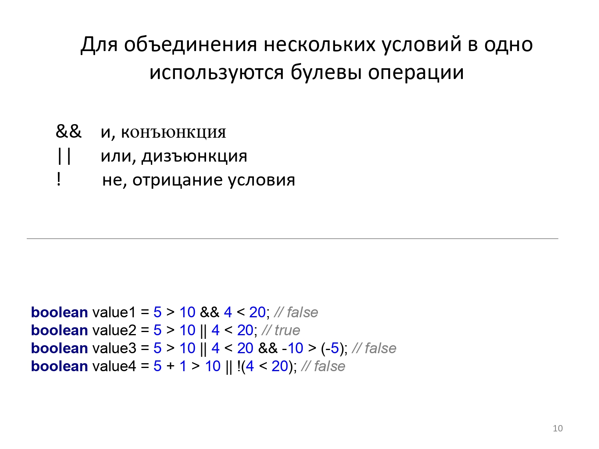

## Типы данных:

Примитивные типы данных.
> * int (числовой, целочисленные значения)
> * double (числовой, вещественные значения)
> * boolean (логический, принимает значения true или false)

* Объявление: `тип названиеПеременной;`  Пример: `int count;` `double square;`, переменной не присвоено значение
* Инициализация `тип названиеПеременной = значение`  Пример: `int count = 5; count = 10;` `boolean isValid = false;`

Ссылочные (объектные).
> * String (строка)
> * Math (класс для математических операций)
> * Scanner (класс для потока данных)
> * System (строка)
> * Integer (ссылочное представление целочисленного числа)
> * Double (ссылочное представление вещественного числа)
> * Boolean (ссылочное представление логического типа)

* Объявление: `Тип названиеПеременной;`  Пример: `Integer count;` `String name;` , переменная не указывает на область
  памяти, поэтому значение переменной = null
* Инициализация `Тип названиеПеременной = new Тип()`
  Пример: `Passport p = new Passport();` `Scanner sc = new Scanner(System.in);`

### *Как отличить примитивный тип данных от ссылочного?*

* Ссылочный тип требует выделения памяти при инициализации переменной (ключевое слово new).
* Ссылочный тип имеет собственную реализацию класса, поэтому примитивные типы пишутся с **маленькой** буквы, ссылочные
    - **с большой** (так тип имеет за собой класс). Для того, чтобы проверить, есть ли у типа реализация класса -
      используем комбинацию клавищ ctrl + левая клавиша мыши, находясь на названии типа. Если тип ссылочный - нас
      перекинет в реализацию класса.

## Условный оператор

Для чего нужен условный оператор? Оператор условия необходим для того, чтобы в зависимости от истинности условия,
происходило выполнение определённого участка кода.

#### Где можно встретить условия?

> Если денег на счёте меньше, чем требует снять клиент - отказать ему в операции
>
> Если сданы все лабы - поставить оценку пять
>
> Если дискриминант меньше нуля - вывести сообщение "действительных корней не существует"


Условный оператор работает с типом данных boolean для вычисления истинности условия.

#### Операции сравнения :

> **==** проверить равенство значений; 5 == 5 вернёт true, 5 == 4 вернёт false
>
>**!=** проверить неравнество значений; 5 == 4 вернёт true, 5 == 5 вернёт false
>
>**>=** левый аргумент больше или равен правому; 5 >= 5 вернёт true, 4 >= 5 вернёт false
>
>**<=** правый аргумент больше или равен левому; 5 <= 5 вернёт true, 6 <= 5 вернёт false
>
>**>** левый аргумент больше правого; 6 > 5 вернёт true, 5 > 5 вернёт false
>
>**<** правый аргумент больше левого; 4 < 5 вернёт true, 5 < 5 вернёт false

#### Объединение условий:

> && логическое И
>
>|| логическое ИЛИ

#### Работа операторов

1 - это ```true```

0 - это ```false```

```ОПЕРАЦИЯ &&```

| Левый аргумент | Правый аргумент | Результат |
|----------------|-----------------|-----------|
| 1              | 1               | 1         |
| 1              | 0               | 0         |
| 0              | 1               | 0         |
| 0              | 0               | 0         |

```ОПЕРАЦИЯ ||```

| Левый аргумент | Правый аргумент | Результат |
|----------------|-----------------|-----------|
| 1              | 1               | 1         |
| 1              | 0               | 1         |
| 0              | 1               | 1         |
| 0              | 0               | 0         |

## Синтаксис условного оператора

### Любые условия размещаются в ТЕЛЕ МЕТОДА

### if (здесь пишем условие) { }

 ```
if (arg > 100) {
  System.out.println("arg > 100");
}
 ```

Если нам требуется **поведение по умолчанию**, то необходим участок кода, который выполнится, если НИ одно из предыдущих
условий
не было истинным. Добавляем блок **else**:

```
if (arg > 100) {
  System.out.println("arg > 100");
} else {
  System.out.println("arg <= 100");
}
 ```

Если нам необхоимы дополнительные проверки, то добавляем if к блоку else:

```
if (arg > 100) {
  System.out.println("arg > 100");
} else if (arg > 50) {
  System.out.println("arg > 50");
} else if (arg > 10) {
  System.out.println("arg > 10");
} else {
  System.out.println("arg <= 10");
}
```

## ЗАМЕЧАНИЕ: блок else (при необходимости) всегда ставим самым последним в цепочке проверки, так как это поведение по умолчанию. После этого блока новых условий в цепочке быть уже не может.


